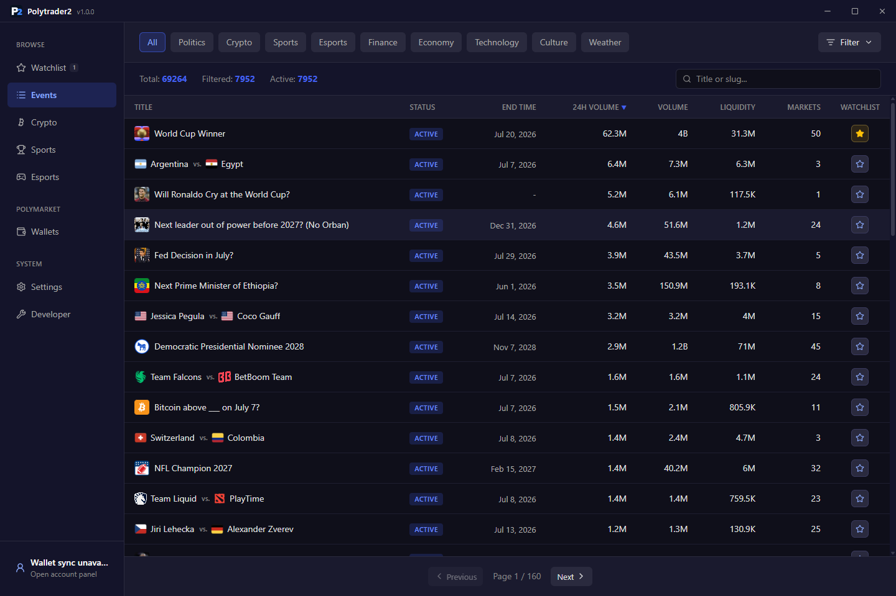
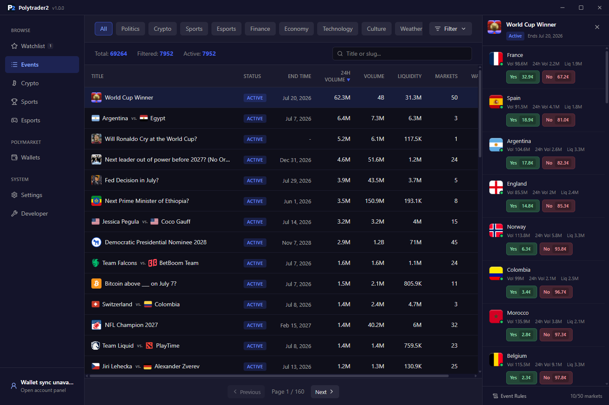
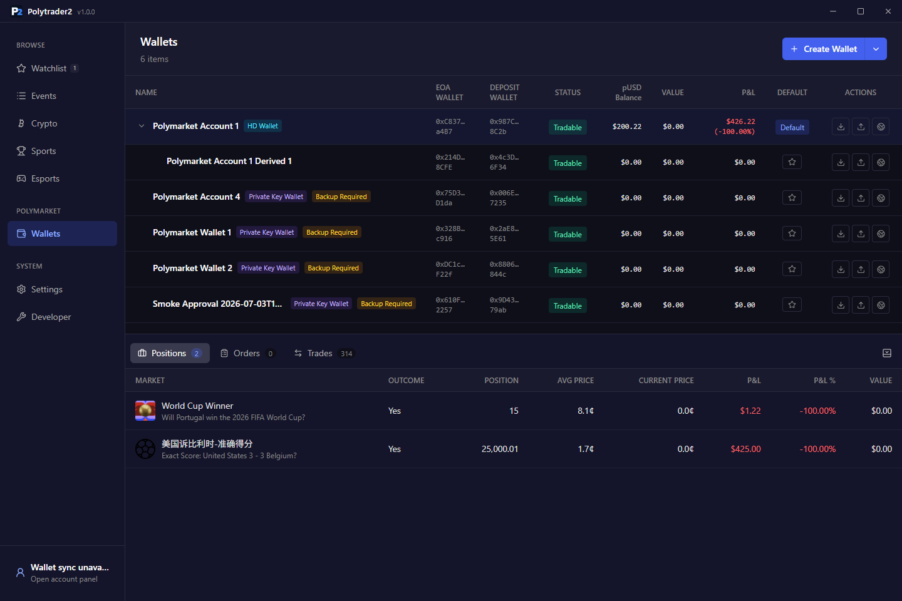
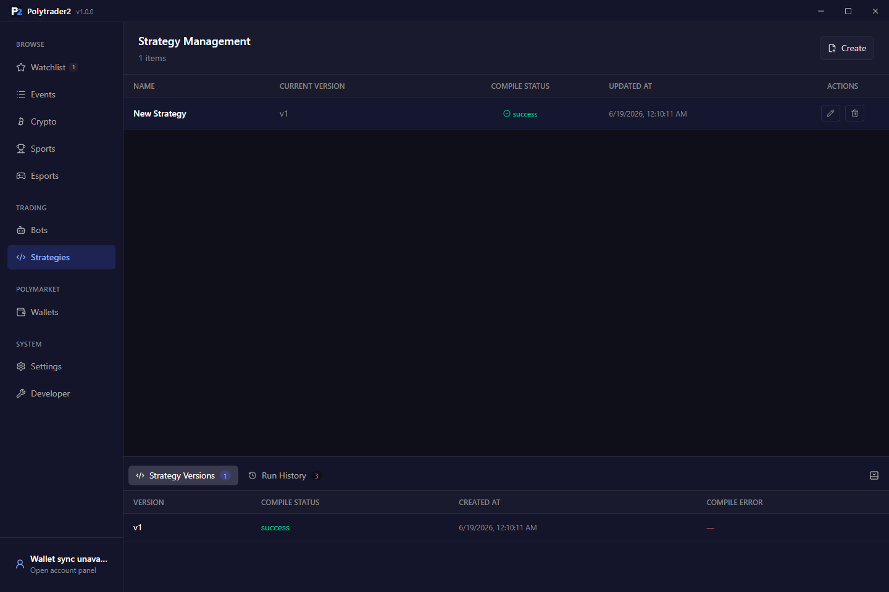

# Polytrader2

[English](./README.md)

**面向 Polymarket 的桌面交易工作台。**

Polytrader2 帮助你在一个应用里更快浏览 Polymarket 市场、管理本地钱包、分析行情、执行交易，并运行自动化策略。

市场数据会同步到本地缓存，浏览和筛选更快。钱包私钥加密保存在你的机器上，交易在本地签名。本地 AI Agent 可以通过 MCP 接入，帮助查看市场、编写策略和复盘机器人运行。

## 演示

[观看 Polytrader2 产品演示](https://example.com/polytrader2-demo)

## 截图

| 市场 | 交易 |
| --- | --- |
|  |  |

| 钱包 | 策略 |
| --- | --- |
|  |  |

## 你可以用它做什么

- 从本地缓存快速浏览 Polymarket 市场。
- 筛选通用市场、Crypto、Sports、Esports 和 Watchlist。
- 打开独立交易窗口，查看订单簿、价格历史、近期成交和市场详情。
- 创建、导入、派生和管理 Polymarket 钱包。
- 查看钱包余额、订单、成交、持仓和持仓汇总。
- 通过 Polymarket bridge 工作流入金和提款。
- 编写 TypeScript 策略并保留版本历史。
- 启动和停止策略机器人，并查看日志、运行记录和生成的订单。
- 通过 MCP 接入本地 AI Agent。

## 如何使用

1. 启动应用并选择本地数据目录。
2. 同步 Polymarket 市场数据。
3. 添加或导入钱包。
4. 浏览市场并打开交易窗口。
5. 手动交易，或创建自动化策略。
6. 在应用内查看订单、持仓、机器人运行和日志。

## 钱包安全

Polytrader2 的设计目标是让私钥不离开你的机器。

- 钱包关键材料在本地加密保存。
- Windows 通过 Electron secure storage 使用 DPAPI。
- macOS 通过 Electron secure storage 使用 Keychain。
- 交易在本地完成签名。
- 项目开源，可审计。

Polytrader2 可以操作真实钱包并提交真实订单。请把每个已配置钱包都视为真实可用钱包。

## AI Agent 支持

Polytrader2 提供本地 MCP Server，可供 Codex、Claude Code 和其他本地 Agent 接入。

Agent 可以帮助查询本地市场数据、起草策略代码、编译策略、检查机器人和复盘运行日志。桌面应用仍然是钱包、策略执行和交易状态的控制平面。

## 本地策略运行

策略在本地隔离运行环境中执行。策略源码、版本、编译状态、机器人配置、运行日志和生成的订单记录都可以在应用内检查。

## 从源码构建

如果你想从源码运行或打包应用，请查看 [从源码构建](./docs/build-from-source.zh-CN.md)。

## 许可证

Apache-2.0。详见 [LICENSE](./LICENSE)。
